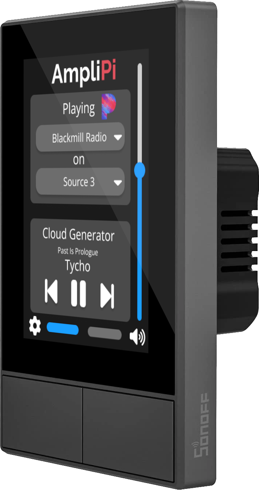
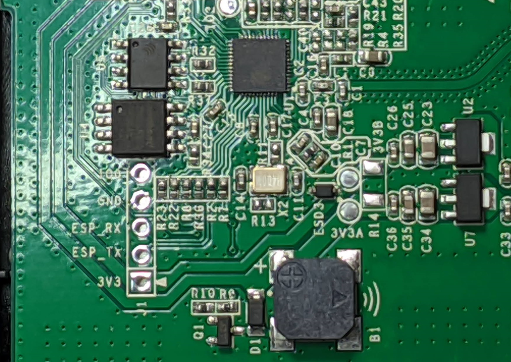

<p align="center">
  
  </img>
</p>

# Overview
The AmpliPi wallpanel is an in-wall touch interface for controlling an AmpliPi Zone or Group of Zones in your house. It uses the [NSPanel by Sonoff](https://sonoff.tech/product/smart-wall-swtich/nspanel) with custom controller firmware and display UI. Since it uses the NSPanel, the firmware can be loaded on an existing panel by following these [steps](#programming-the-nspanel). Preloaded wall panels can be purchased [at the MicroNova web store](https://www.micro-nova.com/amplipi/store/amplipi-in-wall-wifi-touchscreen-controller-with-integrated-2-device-switch).

## Setup
After installation, the wallpanel needs to be connected to the same Wi-Fi that the AmpliPi is connected to. To do this, go to settings, connection, then select an SSID from the drop-down and enter the password. Press connect then return to settings to select a zone or group. Going back to the home page, the device should now be operational. If not, then you may need to specify the AmpliPi's IP manually in the connection settings. 

## Controller
Built on a MicroPython runtime and runs on an ESP32. It can adjust zone and group volumes using AmpliPi's API.

## Button-controlled Relays
The two physical buttons can control two low-powered light circuits, see the [NSPanel specifications](https://sonoff.tech/product/smart-wall-swtich/nspanel) for full details. We are planning on exposing the physical buttons via MQTT in the future.

## Display
The NSPanel uses a Nextion display for the touch panel display that communicates directly with the controller. The UI has been completely customized for controlling an AmpliPi Zone or Group.

## Comms
The ESP32 controls the touch panel by sending and receiving [Nextion instructions](https://nextion.tech/instruction-set/) over UART to the display's STM32.

## Updates
The panel uses GitHub releases to provide firmware and UI updates. New releases available will be indicated by a red exclamation point next to the settings icon.

## Programming the NSPanel
If you have your own NSPanel, you can flash this software to the device using [esptool](https://docs.espressif.com/projects/esptool/en/latest/esp32/). You will need a USB to UART converter. Unclip the panel from the base, remove four screws and lift the plastic cover. The five pins, 3V3, RX, TX, GPIO0 and GND are needed, with GPIO0 connected to GND to put the esp32 into bootloader mode. 
<p align="center">
  
  </img>
</p>


Once you have this wired up to your flasher, you can download [0.1.22.bin](https://github.com/micro-nova/AmpliPiWallPanel/releases/download/0.1.22/0.1.22.bin) and flash it using the command "esptool.py -p COM3 -b 460800 write_flash 0x0 0.1.22.bin", where COM3 is your flasher's port. 

After this flashes, you can reassemble and install the device into a wall socket. The esp32 should start flashing the nextion display automatically shortly after powering on. Since this bin is likely not the latest version, after setup, you can go into settings->update and update to the latest verison.

## Setting up MQTT with Home Assistant
### 1. Setting Up an MQTT Broker 
Set up an MQTT broker with Home Assistant if you haven't already. It's recommended to use the Mosquitto MQTT broker addon with Home Assistant, you can install it by following the steps [here](https://github.com/home-assistant/addons/blob/master/mosquitto/DOCS.md).

### 2. Configure Home Assistant
Open your configuration.yaml (if you don't know how to do this follow the steps under editing configuration.yaml [here](https://www.home-assistant.io/docs/configuration/#editing-configurationyaml)) and add the following lines replacing  ``{Room Name}`` with the name of the room you placed your wall panel in and the ``{Switch Name}``'s with what you want the respective switches to appear as in Home Assistant.
```
switch:
- platform: mqtt
name: "{Switch 1 Name}"
state_topic: "home/{Room Name}/wp/relay1/status"
command_topic: "home/{Room Name}/wp/relay1/cmd"
payload_on: "on"
payload_off: "off"
state_on: "on"
state_off: "off"
optimistic: false
retain: true

- platform: mqtt
name: "{Switch 2 Name}"
state_topic: "home/{Room Name}/wp/relay2/status"
command_topic: "home/{Room Name}/wp/relay2/cmd"
payload_on: "on"
payload_off: "off"
state_on: "on"
state_off: "off"
optimistic: false
retain: true
```
###### For more information about the purpose of values in the above configuration read the documentation [here](https://www.home-assistant.io/integrations/switch.mqtt/#full-configuration).

For the above changes to take effect you must restart Home Assistant, but you can continue with the final step while it reboots!

### 3. Configure Your Wallpanel
Firstly, make sure your Wallpanel is updated to at least version 0.2.0.

On your wallpanel navigate to MQTT settings. (gear icon->advanced->MQTT) and enter the your MQTT broker's ip address, a room name, and if necessary, a username and password for your broker.
###### Note: your wall panel will automatically set the room it's in to the name of the zone it's first attached to.

At this point your wallpanel should work with Home Assistant, you can test this by simply turning the switches on and off in Home Assistant and on the panel while watching to see if it's state changes on the other.
